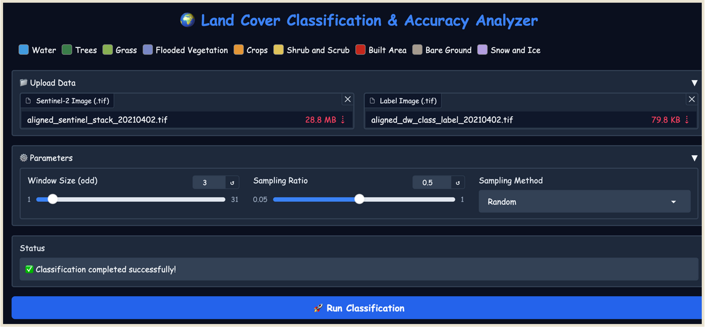
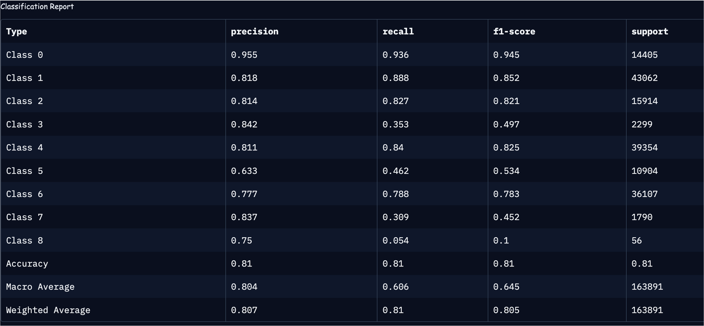

# Land Cover Classification & Accuracy Assessment

## Overview
This project implements **land cover classification** using Sentinel-2 satellite imagery, with an emphasis on **accuracy analysis procedures** such as **Overall Accuracy**, **User’s Accuracy**, **Producer’s Accuracy**, **Kappa Coefficient**, and **Tau Statistic**.  
The methodology leverages a **Random Forest classifier** with **window-based feature extraction**, providing a user-friendly **Gradio interface** for interactive classification, accuracy assessment, and results export.

Developed as part of **CE672: Machine Processing of Remotely Sensed Data** at *Indian Institute of Technology Kanpur* (2024–25).

---

## Features
- **Interactive Gradio Interface** for classification and accuracy analysis.
- Supports **Sentinel-2 GeoTIFF input** with corresponding label image.
- **Configurable parameters**:
  - Window size
  - Sampling ratio
  - Sampling method (Random / Stratified)
- **Accuracy metrics**:
  - Overall Accuracy
  - User’s & Producer’s Accuracy
  - Kappa Coefficient & Tau Statistic
  - Z-Statistic & Sigma Kappa
- **Export results** to Excel and HTML.
- **Visualization** of classification maps and confusion matrices.
- **Exploratory Data Analysis** (EDA) on sampled pixels.
- 
### Interface

---

## Methodology
1. **Data Upload**  
   - **Sentinel-2 Image (.tif)** – multi-band spectral data  
   - **Label Image (.tif)** – ground truth classification map

2. **Sampling**  
   - Random or stratified sampling of labeled pixels  
   - Adjustable sampling ratio

3. **Feature Extraction**  
   - Window-based pixel neighborhoods (e.g., 3×3, 5×5, 7×7)  
   - Flattened spectral-spatial features

4. **Model Training**  
   - Random Forest classifier (`n_estimators=100`, `max_depth=30`)  
   - 80-20 train-test split

5. **Evaluation & Reporting**  
   - Accuracy metrics calculation  
   - Confusion matrix generation  
   - Exportable reports (Excel, HTML)  

---

## Dataset
- **Source**: [Google Dynamic World V1](https://dynamicworld.app)  
- **Resolution**: 10 meters  
- **Sensor**: Sentinel-2 Level-1C imagery  
- **Classes**: Water, Trees, Grass, Urban, Cropland, Snow/Ice, Shrub/Scrub, Bare Ground, Flooded Vegetation

### Satellite Image Data

### Label Data Visualization

---

## Results Summary
- **Best Accuracy**: Achieved with **moderate window sizes** (5×5 or 7×7) and **stratified sampling**.
- **Sampling Ratio**: Higher ratios improve accuracy but increase computation.
- **Kappa Coefficient**: 0.7096–0.7969  
- **Overall Accuracy**: 0.7242–0.9025  

### EDA

### Results on Gradio Interface

---

## Limitations
- Only supports Sentinel-2 `.tif` imagery.
- Fixed class definitions (hardcoded 9-class scheme).
- No built-in handling for clouds or missing data.
- Limited to Random Forest classifier.

---

## Future Improvements
- Support multiple satellite data formats (Landsat, MODIS).
- User-defined class schemes and legends.- Additional classifiers (SVM, k-NN, Neural Networks).
- GPU acceleration for large-scale processing.
- Advanced automated accuracy assessment techniques.

---

